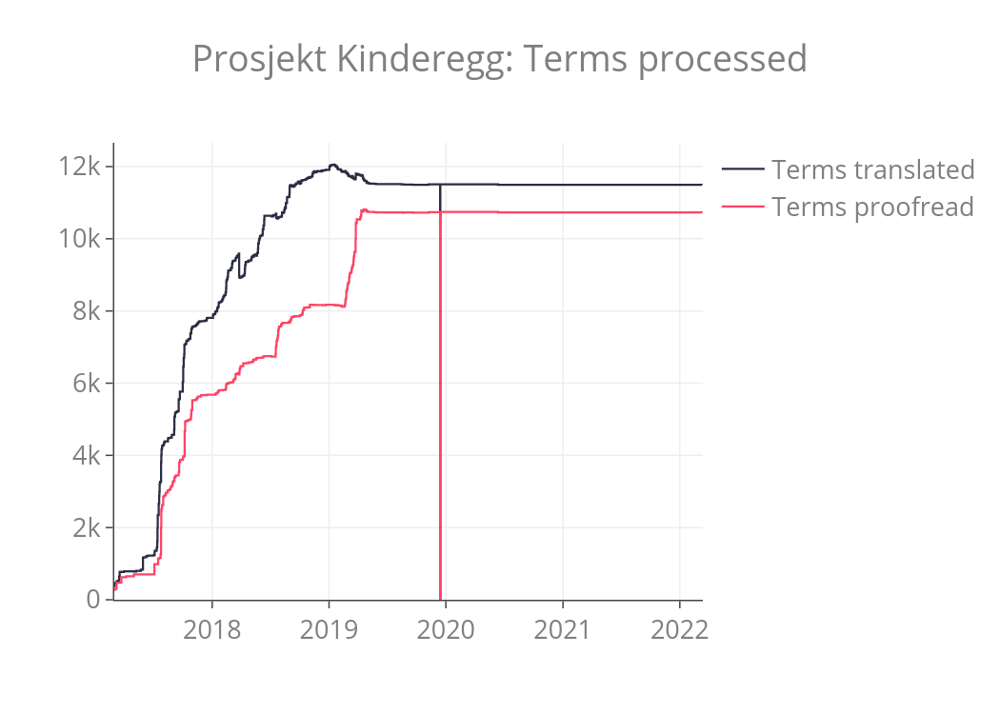
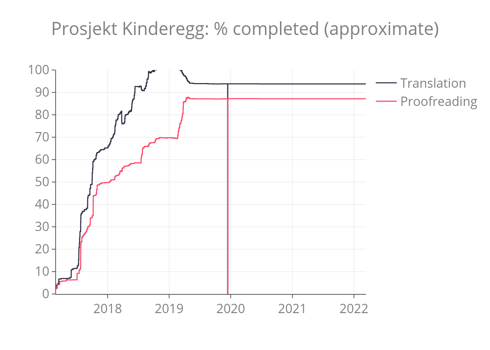

# Prosjekt Kinderegg

This repo contains data and stats from *Prosjekt Kinderegg* (the Kinder egg project),
exported from the [soksed](https://github.com/danmichaelo/soksed) tool nightly whenever
there are new changes.

The Kinder egg project, started on 20 February 2017, is about increasing the value and usefulness of the [Realfagstermer](https://github.com/realfagstermer/realfagstermer) vocabulary by adding three things at the same time (thus the name): something good (translation of all terms to English), something to play with (categorization of concepts in disciplinary categories) and a surprise (mappings to Wikidata).
For the mapping part, mappings are only established when there is a quite clear one-to-one relationship and all mappings are considered as `skos:closeMatch` at this point.

